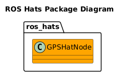

# ROS Hats
[](https://github.com/fastrobotics/ros_hats/actions/workflows/Push.yml)

__TOC__
- [ROS Version Support](#ros-version-support)
- [Overview](#overview)
- [Messages](#messages)
- [Supported Hats](#supported-hats)
- [Sister Repositories](#sister-repositories)
- [Compatability](#compatability)
- [Setup Instructions](#setup-instructions)
- [Usage Instructions](#usage-in-your-package)
- [Development Instructions](#development-instructions)
- [Test Plan](#test-plan)

Welcome to the ros_hats Wiki!


[Source Code Documentation](https://dgitz.github.io/ros_hats/)

## ROS Version Support
ros_hats will target ROS Noetic for current and releases.

## Overview
This repo provices some ROS nodes to interface with Raspberry Pi Hats.

## [Supported Hats](doc/SupportedHats/SuportedHats.md)
 

## Compatability
This package is currently compatible with the following architectures:
* Any x86/64 compatible system
* ARM7L (such as Raspberry Pi 2 or 3)


If you would like to use this in your project on an architecture that is not currently supported (but is still ROS compliant), let me know and I'll see what I can do to help.

## Setup Instructions
First follow setup instructions for [eros-Setup Instructions](https://github.com/fastrobotics/eros?tab=readme-ov-file#setup-instructions).

Then run the following your device:
```bash
sudo apt install gpsd libgps-dev
```

## Software Design



## [Development Instructions](doc/Development/DevelopmentInstructions.md)

## [Test Plan](doc/TestPlan/TestPlan.md)