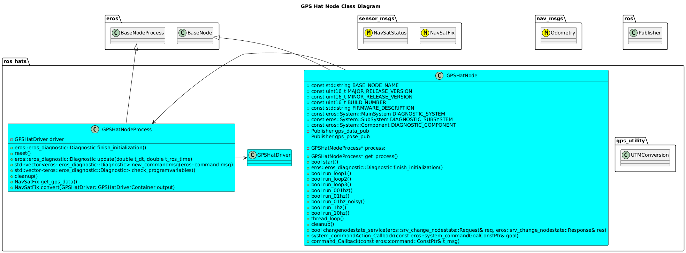
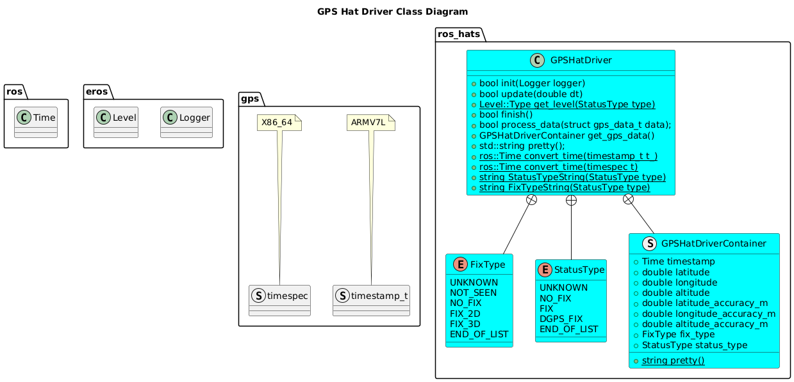
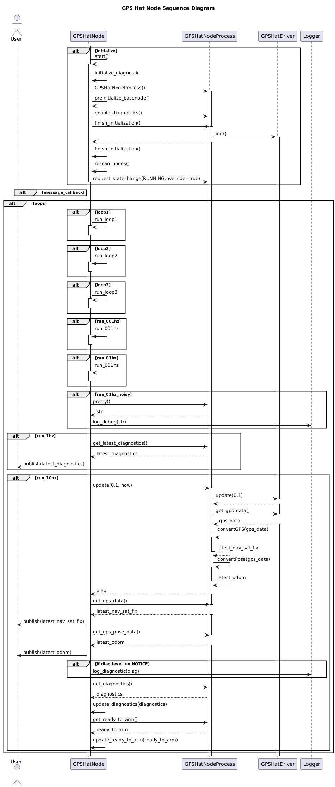

# GPS Hat

## How It Works
The GPS Hat [available from Adafruit here](https://www.adafruit.com/product/2324) can connect to a Raspberry Pi and publish GPS Position information.

The GPS Hat Node will publish a topic of type [sensor_msgs/NavSatFix](https://docs.ros.org/en/noetic/api/sensor_msgs/html/msg/NavSatFix.html).

## Setup Instructions
To setup the GPS Hat on your Device, follow the [Adafruit Instructions here](https://learn.adafruit.com/adafruit-ultimate-gps-hat-for-raspberry-pi).

## Usage Instructions
### GPS Hat Node
The GPS Hat Node can be used to connect to a GPS Device and publish GPS data over ROS.
#### Configuration
A reference launch file for the node can be found at [GPS Hat Node Launch](../../../nodes/GPSHatNode/launch/gps_hat_node.launch).

### Test Driver
A Test Executable for the GPS Hat Driver can be ran by running:
```bash
/install/bin/exec_gps_driver
```
This will give output similiar to:
```bash
[18/02/2025 02:17:45 exec_GPSHatDriver]: DEBUG: Starting GPS Driver
[18/02/2025 02:17:45 exec_GPSHatDriver]: NOTICE: GPSD Is Running.
[18/02/2025 02:17:45 exec_GPSHatDriver]: WARN: NO Fix
[18/02/2025 02:17:46 exec_GPSHatDriver]: INFO: GPS: T=0.000000 Lat: 0.000000 (Deg) Long: 0.000000 (Deg)
[18/02/2025 02:17:46 exec_GPSHatDriver]: INFO: GPS: T=0.000000 Lat: 0.000000 (Deg) Long: 0.000000 (Deg)
[18/02/2025 02:17:46 exec_GPSHatDriver]: INFO: GPS: T=0.000000 Lat: 0.000000 (Deg) Long: 0.000000 (Deg)
[18/02/2025 02:17:46 exec_GPSHatDriver]: INFO: GPS: T=0.000000 Lat: 0.000000 (Deg) Long: 0.000000 (Deg)
[18/02/2025 02:17:46 exec_GPSHatDriver]: WARN: NO Fix
[18/02/2025 02:17:47 exec_GPSHatDriver]: INFO: GPS: T=0.000000 Lat: 0.000000 (Deg) Long: 0.000000 (Deg)
[18/02/2025 02:17:47 exec_GPSHatDriver]: WARN: NO Fix
[18/02/2025 02:17:47 exec_GPSHatDriver]: INFO: GPS: T=0.000000 Lat: 0.000000 (Deg) Long: 0.000000 (Deg)
[18/02/2025 02:17:47 exec_GPSHatDriver]: INFO: GPS: T=0.000000 Lat: 0.000000 (Deg) Long: 0.000000 (Deg)
[18/02/2025 02:17:47 exec_GPSHatDriver]: INFO: GPS: T=1739845067.000677 Lat: 40.931603 (Deg) Long: -89.766058 (Deg)
[18/02/2025 02:17:48 exec_GPSHatDriver]: INFO: GPS: T=1739845067.000927 Lat: 40.931603 (Deg) Long: -89.766058 (Deg)
[18/02/2025 02:17:48 exec_GPSHatDriver]: INFO: GPS: T=1739845068.000178 Lat: 40.931603 (Deg) Long: -89.766058 (Deg)
[18/02/2025 02:17:48 exec_GPSHatDriver]: INFO: GPS: T=1739845068.000178 Lat: 40.931603 (Deg) Long: -89.766058 (Deg)
[18/02/2025 02:17:48 exec_GPSHatDriver]: INFO: GPS: T=1739845068.000679 Lat: 40.931605 (Deg) Long: -89.766063 (Deg)
[18/02/2025 02:17:49 exec_GPSHatDriver]: INFO: GPS: T=1739845068.000930 Lat: 40.931605 (Deg) Long: -89.766063 (Deg)

```

### Other Tools
#### gpsmon
```bash
gpsmon
```

#### cgps
```bash
cgps -s
```


## Software Design

### Class Diagrams



### Sequence Diagrams

# References

- https://learn.adafruit.com/adafruit-ultimate-gps-hat-for-raspberry-pi/use-gpsd

# Troubleshooting