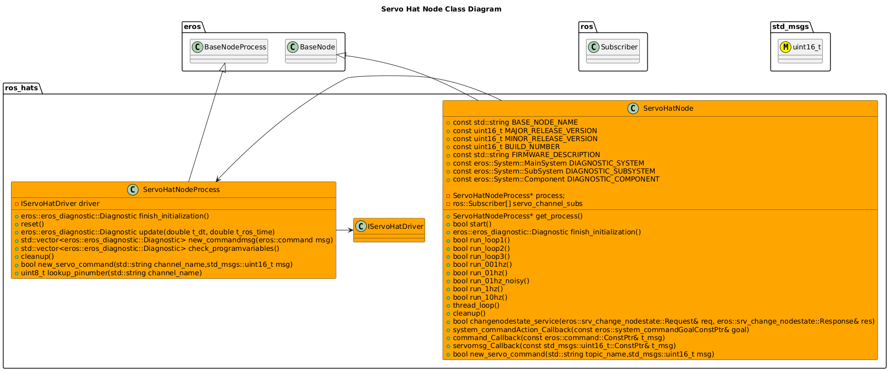
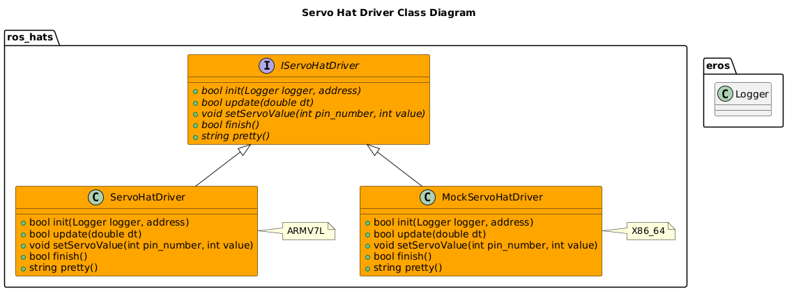
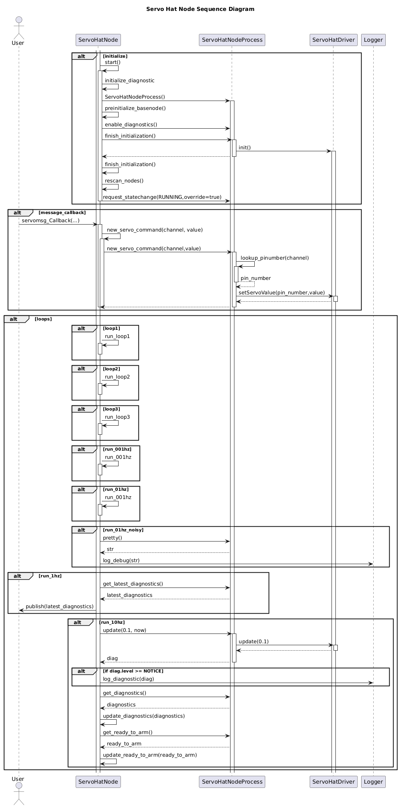
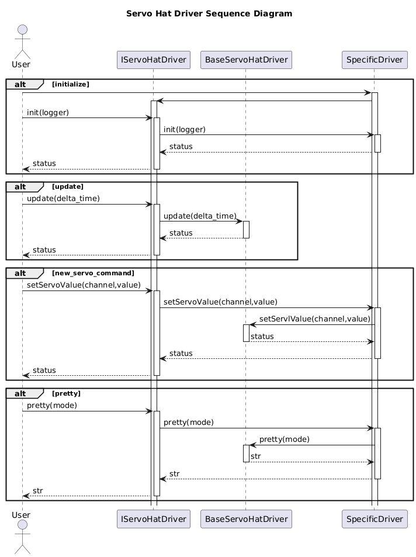

# Servo Hat

## How It Works

## Setup Instructions


## Usage Instructions
### Servo Hat Node

#### Configuration


### Test Driver
A Test Executable for the GPS Hat Driver can be ran by running:
```bash
/install/bin/exec_servohat_driver
```
This will give output similiar to:
```bash
-h This Menu.
-r Reset all Channels.
-c Channel Number.
-m Mode: ramp,direct.
-v Value to Set.

```
Examples:

Reset all Channels:
`/install/bin/exec_servohat_driver -r`

Ramp up/down Channel 3:
`/install/bin/exec_servohat_driver -c 3 -m ramp`

Set Channel 4 to a specific value of 800
`/install/bin/exec_servohat_driver -c 3 -v 800`

### Other Tools


## Software Design

### Class Diagrams



### Sequence Diagrams



# Troubleshooting


# References
- https://projects.drogon.net/raspberry-pi/wiringpi/i2c-library/
- https://learn.adafruit.com/adafruit-16-channel-pwm-servo-hat-for-raspberry-pi/attach-and-test-the-hat
- https://learn.adafruit.com/adafruits-raspberry-pi-lesson-4-gpio-setup/configuring-i2c