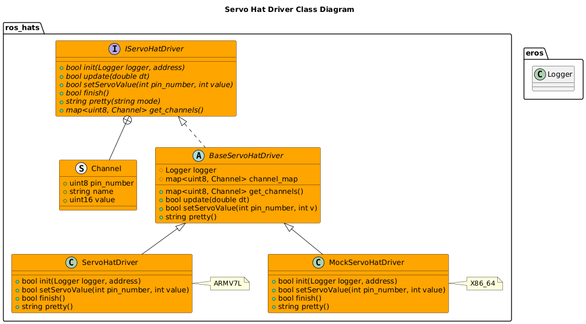

# Servo Hat

## How It Works

## Setup Instructions


## Usage Instructions
### Servo Hat Node

#### Configuration


### Test Driver
A Test Executable for the GPS Hat Driver can be ran by running:
```bash
/install/bin/exec_servohat_driver
```
This will give output similiar to:
```bash

```

### Other Tools


## Software Design

### Class Diagrams



### Sequence Diagrams
s

# Troubleshooting


# References
- https://projects.drogon.net/raspberry-pi/wiringpi/i2c-library/
- https://learn.adafruit.com/adafruit-16-channel-pwm-servo-hat-for-raspberry-pi/attach-and-test-the-hat
- https://learn.adafruit.com/adafruits-raspberry-pi-lesson-4-gpio-setup/configuring-i2c